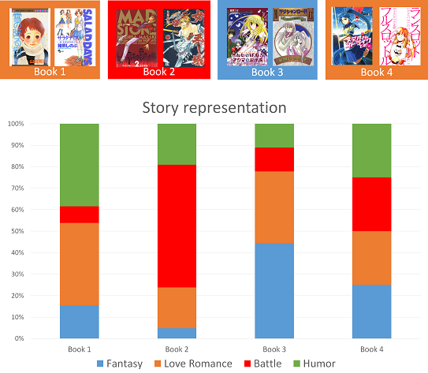

# Comics Story Representation Based on Genre

Comic and manga books are usually classified into broad categories called ``genres'' according to their content such as comedy, horror, science fiction, etc. However, giving only one genre to one comic cannot express the detailed difference of the story. We propose a system for generating comics story representation as a sub-sequence of genres. We propose a method based on a deep neural network (CNN) to classify each page into the corresponding genre in order to represent the comics story [1].

For one book, the obtained representation will be like this:

Each book can then be represented as a specific sequence of genre. 

We used comics images from the dataset Manga109 which are freely available for research purpose [2] and labeled 5003 single pages of this dataset. These labels are provided in the xlsx format (one file per genre, where the genre of a book is defined in the Manga109 dataset). Each xlsx file contains the labels for each page of several books. The file [class.txt](class.txt) contains information about the labels.

[1] Yuki Daiku, Motoi Iwata, Olivier Augereau and Koichi Kise "Comics Story Representation System Based on Genre", 13th IAPR International Workshop on Document Analysis Systems, 2018.

[2] http://www.manga109.org/en/
